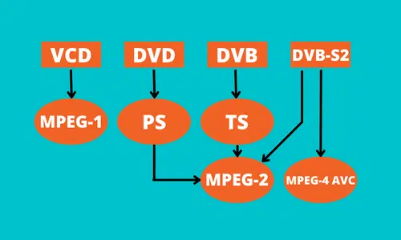

# video codec information

## MPEG 

`Motion Picture Experts Group (MPEG)` has defined a set of standards for video and audio compression coding and multimedia delivery since the early `1990s`. The compression ratio achieved with MPEG encoding is the ideal standard for digital video data delivery. MPEG standards do not specify the operation of the encoder but allow encoder implementations to improve over time. Hence, various features have been added from one profile to another, aiming to increase its complexity and efficiency.  Here are a few MPEG standards that have allowed enormous innovation while maintaining their interoperable standard. These standards would guide you in selecting the desired video format.

### MPEG 1

MPEG started developing coding formats in `1992`. It first defined the MPEG-1 coding format that was commonly applied to `Video-CD` and low-quality video on `DVD Video`. It was also used in digital satellite/ cable TV services before MPEG-2 Codex was introduced.

MPEG-1 downsamples the images to meet the low-bit requirement and uses only 24-30 Hz, resulting in moderate quality videos. Also, MPEG-1 was designed for coding progressive video at a transmission rate of around 1.5 million bits per second. The popular `MPEG-1 audio layer III (MP3)` audio compression is included in this format, which compresses a sound sequence to a smaller file preserving the original audio quality. 

### MPEG 2

MPEG-2 is considered to be the enhanced MPEG-1 format in terms of quality used for DVD productions. This standard was created to encode high-quality videos by coding interlaced images at transmission rates over 4 million bits per second. This codec was developed in 1994 and is commonly applied to digital television broadcasts, Video on Demand, DVD, VCD, and similar discs. It generally uses lossy compression techniques to reduce file sizes for audio and video files substantially. 

MPEG-2 encoded video files are much bigger and require a lot more bandwidth for streaming. In addition, with a few enhancements, MPEG-2 Video and Systems are also used in some HDTV transmission systems and are considered to be the standard format for over-the-air ATSC digital television. The MPEG-2 players can handle MPEG-1 data as well.

### MPEG 3

The Moving Picture Experts Group (MPEG) also developed a set of audio and video coding standards known as MPEG-3 that can handle HDTV signals at 1080p in the 20 to 40 megabits per second range. While MPEG-2 was being developed, an attempt was made with MPEG-3 to address the requirement for an HDTV standard. However, it soon became clear that HDTV could be supported by MPEG-2 at high data rates.  As a result, MPEG-3 was incorporated into MPEG-2 in 1992, and HDTV was added as a separate profile.

### MPEG 4

MPEG-4, created in 1998, is the latest audio/video compression method by the MPEG group that is specifically designed for low-bandwidth (less than 1.5 Bit/sec bitrate) video/audio encoding while providing superior audio and video quality compared to MPEG-2 format. It is designed to deliver DVD-quality video (MPEG-2 format) at lower data rates and smaller file sizes. The MPEG-4 is an encoding method for portable devices like media players and mobile phones and online stores that hire video and audio files. 
### Learn the differences between MPEG-2 and MPEG-4 before selecting a format for your videos.
Though MPEG-4 absorbs many features from MPEG-1 and MPEG-2, it is very different in focus from these standards as it focuses on multimedia and interactivity. The MPEG-4 standard tackles the creation and definition of the media items in a multimedia presentation, their synchronization and relationship during transmission, and how users can interact with the media objects. In simple terms, the visual scenes are broken down into objects to be sent as separate layers, which are then composed at the decoder. In general, MPEG-4 is a far more versatile encoding format than MPEG-2.

| Parameters | MPEG-2 | MPEG-4 |
| --- | --- | --- |
| Compression| MPEG-2 uses lossy video and audio data compression methods to maintain uniform audio & video quality. Its compression ratio is less than MPEG-4| MPEG-2 uses lossy video and audio data compression methods to maintain uniform audio & video quality. Its compression ratio is less than MPEG-4
| File name extensions|A few of the filename extensions used with MPEG-2 audio and video files include.mpg,.mpeg,.m2v,.mp2, and mp3. |.mp4,.m4a,.m4b,.m4r, and.m4v are a few MPEG4 video/audio file extensions.
|File Size | MPEG-2 can result in movie files  5 times the size of MPEG-4. Despite the larger file size, it yields better video quality.|You can create a full-length movie file in less than 1GB as MPEG-4 encodes video files with substantially reduced sizes.
| Quality| MPEG-2 produces flawless quality compared to MPEG-4. Still, it makes the format impractical for network streaming.|MPEG-4 provides better performance because of its reduced file size when being streamed online.
| Bit rate and Bandwidth|Files encoded in MPEG-2 format have higher bit rates, i.e., tens of megabytes per second. It also requires much more bandwidth while streaming recorded or real-time videos online. |MPEG-4 is aimed at low bit-rate video transmission. The files encoded in MPEG-4 format have much lower bit rates ranging from a few kilobytes to megabytes per second. It requires less bandwidth for streaming videos.
| Application| MPEG-2 is the encoding method for DVDs, television broadcasts, and a few Video-on-Demand platforms. It is also a video coding format supported by Blu-ray Disc.|The MPEG-4 coding standards are generally applied to portable devices, CD distribution, internet streaming, and broadcast television applications as its file size is smaller compared to MPEG-2.
