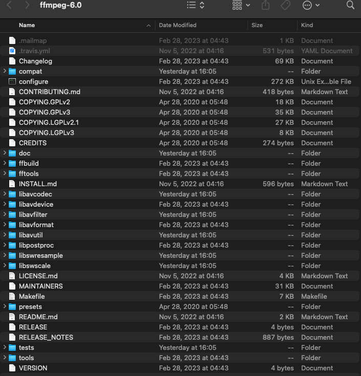

# Linux和Macos ffmpeg开发环境配置

## 声明，此文档针对macos和linux开发环境，但操作流程同样适用于windows

### ffmpeg项目组成

* 源代码项目主要由`开源库`(下面以lib开头的文件夹)和`文档`以及`诊断程序`（./configure）组成

```
libavutil      
libavcodec     
libavformat    
libavdevice    
libavfilter    
libswscale     
libswresample  
libpostproc    
```
如图所示


### 下载源代码

* [源代码下载官网](https://ffmpeg.org/releases/)
选择你需要的版本，比如 `ffmpeg-3.4.1.tar.gz `或`ffmpeg-3.4.1.tar.xz `

* 解压 如果是Linux或MacOS，可以使用命令`tar -xzvf ffmpeg-3.4.1.tar.gz`或者`tar -xzvf ffmpeg-3.4.1.tar.xz`

### 自行build项目
* 下载的源代码项目主要由一些代码文件（.c和.h文件）和文档以及诊断程序组成，如果想要使用该项目的库，是需要手动build的，在Macos或Linux下，Terminal cd到该项目目录下，确保系统有 `cmake`，`yasm` 组件
* 在项目目录下运行诊断工具并build项目（分别运行一下三行指令）
```
./configure
make clean
make -j8
```
* `./configure`指运行该目录下congigure程序，此程序会自动诊断项目完整度
* `make clean`是清空此前build的文件 首次build可以不输入这行指令
* `make -j8`是build项目的指令，`-j8`中的`8`是指调用8个线程来build项目，可依据硬件性能自行修改此数字

### 整理文件以方便调用

* 首先在项目根目录下新建两个文件夹`lib`和`include`
```
mkdir lib && mkdir include
```
* 递归查看.a静态库文件并移动到`lib`文件夹下
```
mv **/*.a lib
```
* 将`源代码`（上文提到的开源库 lib开头的文件夹）所在文件夹移至`include`下
```
find . -maxdepth 1 -type d -name "lib*" ! -name "lib" -exec mv {} include/ \;
```

### 验证是否能用调用库

在任意目录下新建一个代码文件
```
touch test.cpp
```
输入以下代码
```
#include <libavformat/avformat.h>

int main()
{
    return 0;
}
```
在代码所在目录下编译
```
g++ -I/path/to/include test.cpp -o test
```
如果编译成功，说明我们的ffmpeg开发环境配置完成
